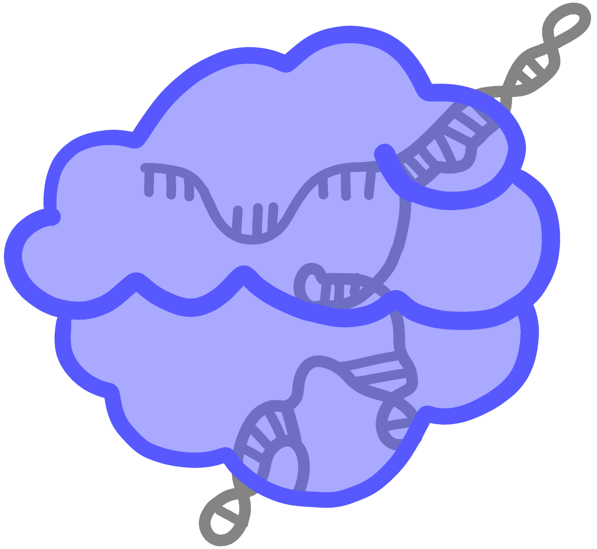

# Sistema inmune

!!! warning "Ojo"
    Aprenderemos también sobre el SARS-Cov2

## Tipos de inmunidad

| Inmunidad innata | Inmunidad adquirida |
| :----: | :----:|
| Presente desde el nacimiento | Se adquiere con el tiempo|
| Actúa en primer lugar | Actúa en segundo lugar |

# Teoría

En breves subiré la siguiente información.

# Práctica

En breves subiré la siguiente información.