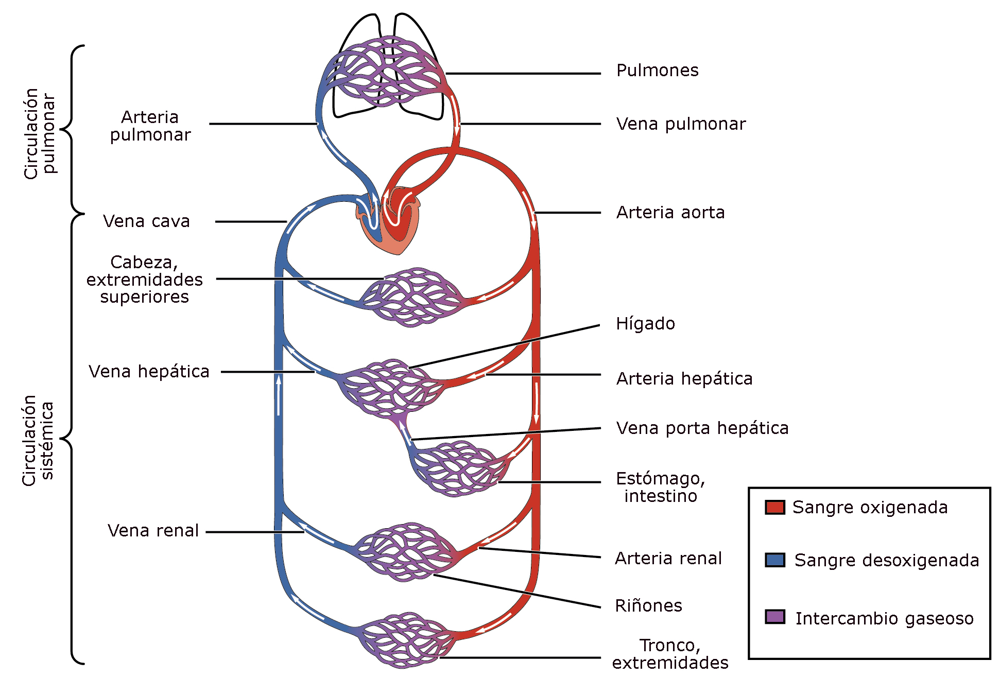

# Sistema circulatorio

Aprenderemos:

* Circulación mayor y menor
* Vasos sanguíneos
* Ciclo cardíaco
* Anatomía e histología

# Teoría

En breves subiré la siguiente información.

# Práctica

En breves subiré la siguiente información.