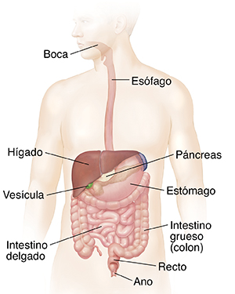

# Sistema digestivo

!!!note "Nota"
    El sistema digestivo abarca una gran cantidad de órganos, por lo que ocupará gran parte del curso.

Os dejo el siguiente vídeo con una de las patologías que veremos en este tema.

<iframe width="560" height="315" 
    src="https://www.youtube.com/embed/lnVjXuyM6xk" title="YouTube video player" frameborder="0" allow="accelerometer; autoplay; clipboard-write; encrypted-media; gyroscope; picture-in-picture; web-share" allowfullscreen>
</iframe>

# Teoría

En breves subiré la siguiente información.

# Práctica

En breves subiré la siguiente información.